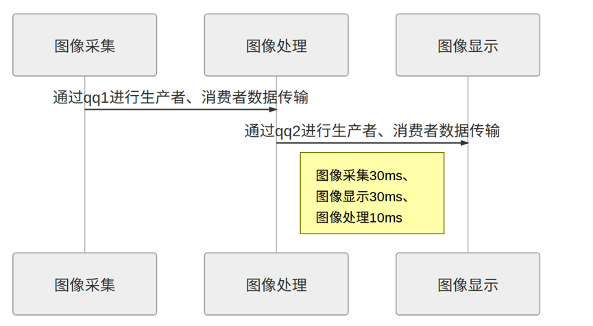

# 2019 机器人学院Linux 大作业 QT界面边缘提取
## 思路
程序采用c++ qt多线程qthread作为系统的多线程系统，利用生产者消费者模型实现多线程数据处理，并利用opencv库进行图像滤波与Canny算子的边缘提取。并利用QT实现上位机显示。
采集到的图像通过线程间同步,传递给图像处理线程，图像处理工作为提取图像边缘，处理完成后把边缘图像传递到显示线程

## 结果


## 程序结构
### 主程序
<!-- ```mermaid
flowchat
st=>start: 开始
e=>end: 结束
op1=>operation: 使用opencv抓取图像
op2=>operation: 将图像转换为灰度图
op3=>operation: 生产者：装入qq1中

st->op1->op2->op3->e
``` -->


### 图像处理线程(边缘提取)
<!-- ```mermaid
flowchat
st=>start: 开始
e=>end: 结束
cond=>condition: qq1是否有“产品”
op1=>operation: 高斯滤波
op2=>operation: Canny边缘提取
op3=>operation: 生产者：装入qq2中

st->cond
cond(yes)->op1
cond(no)->e
op1->op2->op3->e
``` -->


## 图像显示线程
<!-- ```mermaid
flowchat
st=>start: 开始
e=>end: 结束
cond=>condition: qq2是否有“产品”
op1=>operation: 在主界面上显示

st->cond
cond(yes)->op1
cond(no)->e
op1->e
``` -->


### UML




## 依赖
opencv

## 版权
有版权信息，注意主窗体和主程序中的版权信息，请自行去除，主窗体标题栏以及主程序